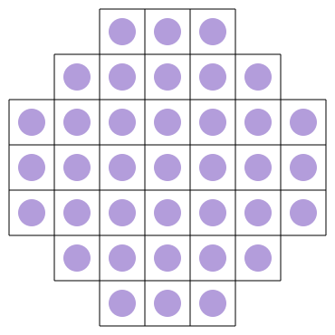

# solisolve

Solveur du **jeu du solitaire** (peg solitaire) écrit en C++, avec rendu dans le terminal via *ncurses* et **animation de la solution dans le navigateur** (SVG + JavaScript).

## Le jeu

Le solitaire se joue sur un plateau en croix (forme anglaise) : une grille 7×7 dont on retire les quatre coins, soit **33 trous**. Au départ toutes les cases sont occupées par une bille sauf une, laissée vide.

Un coup consiste à faire **sauter une bille par-dessus une bille voisine** (haut, bas, gauche ou droite) pour atterrir dans le trou vide juste derrière : la bille sautée est retirée du plateau. Le but est d'enchaîner les sauts jusqu'à ne laisser qu'**une seule bille**.

## Aperçu de l'animation

▶️ **[Voir l'animation de la solution](https://htmlpreview.github.io/?https://github.com/clebail/solisolve/blob/master/anim/anim.html)**

> L'animation rejoue, saut après saut, une solution complète trouvée par le solveur. Elle tourne en boucle.

Le plateau de départ (SVG statique) :



## Fonctionnement

Le projet se découpe en deux exécutables qui se chaînent : le **solveur** produit une suite de coups, l'**outil d'animation** la transforme en animation web.

```
solisolv  ──(coups: D…/M…)──►  anim/result.txt  ──►  anim  ──►  anim.js  ──►  anim.html (SVG)
```

### 1. Le solveur (`solisolv`)

| Classe | Rôle |
|--------|------|
| `CPlateau`  | Représente un état du plateau (49 cases), calcule un *poids* canonique (invariant par rotations/symétries) et énumère les coups possibles. |
| `CCoup`     | Un coup : la case de départ et la direction du saut (`etcHaut`, `etcDroite`, `etcBas`, `etcGauche`). |
| `CPlateaux` | Collection d'états (`std::set`) dédoublonnés via `SPlateauCmp`, pour ne pas réexplorer des plateaux équivalents. |
| `CSolver`   | Moteur de recherche : part des plateaux à une bille manquante puis explore les coups couche par couche jusqu'à converger vers une solution. |

À la fin, `CSolver::process()` écrit la solution sur la sortie standard sous la forme :

```
D A,3 0        # trou vide initial (Départ)
M A,5 0        # Mouvement : bille en A,5, direction 0 (haut)
M C,4 3        # ...
...
```

(le dernier champ d'une ligne `M` est le type de coup : `0`=haut, `1`=droite, `2`=bas, `3`=gauche.)

### 2. L'animation (`anim/`)

`anim/anim` relit ce fichier de coups et génère un tableau JavaScript `var seq = [...]` décrivant chaque transition (déplacement `cx`/`cy` de la bille, puis `opacity:0` de la bille sautée). Ce JS pilote `anim.svg` depuis `anim.html` via jQuery `.animate()`.

## Compilation

Prérequis : `g++` (C++11) et la bibliothèque **ncurses** (`libncurses-dev`).

```sh
# Le solveur
make

# L'outil d'animation
make -C anim
```

## Utilisation

```sh
# 1. Résoudre et sauvegarder les coups
./solisolv > anim/result.txt

# 2. Générer le script d'animation
./anim/anim anim/result.txt > anim/anim.js

# 3. Ouvrir anim/anim.html dans un navigateur
```

Le dépôt fournit déjà un `anim/result.txt` et un `anim/anim.js` d'exemple, c'est cette solution qui est jouée par le lien d'aperçu ci-dessus.
